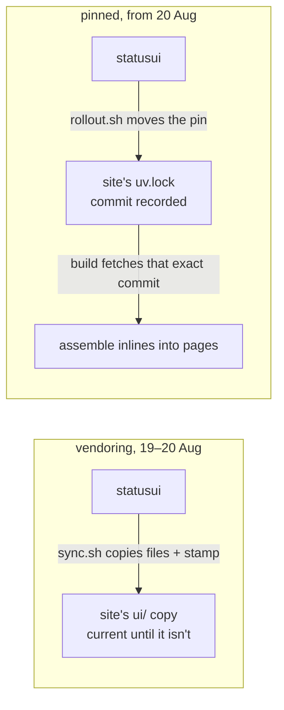

# 2. A pointer beats a copy
*~7 min read · commits `78515fa` → `61b642c` · 20–21 August 2026*

*Where we are:* the layer exists (chapter 1) and lives in each site as a vendored copy: files
duplicated in by a 14-line script, `sync.sh`, each copy stamped with the commit it came from.
This chapter is one day long, and by the end of it the copies are gone.

## The question that opened this stretch

The vendoring decision was made for self-containment: a site with the files copied in builds
with nothing installed, and every layer change shows up as a reviewable diff in that site's
own pull request. The uisce series (chapter 14) boxes the general trade — *vendor or pin* —
from the site's side. What this chapter adds is the producer's experience of the vendoring
day: the question that opened it was not "which model is right?" but the much smaller "why
does the stamp keep lying?" — and the answer to the small question settled the big one.

## What changed

### A stamp is a claim about content (three commits, 20 August)

`sync.sh` copied four files into a consumer and wrote a fifth, `UPSTREAM`, holding the short
hash of the statusui commit the copy came from — with `-dirty` appended if the working tree
had uncommitted changes. Fourteen lines; a solved problem, I thought. It needed fixing three
times in one day.

**Morning.** Syncing a site that was already up to date rewrote `UPSTREAM` anyway — the
stamp moved with no file change, producing one-line pull requests in the consumers that
carried no information. Fix: copy only files that differ; when none do, touch nothing and
say so (commit `78515fa`, 20 Aug, 07:48).

**Evening, part one.** The morning's fix wrote the stamp only when bytes changed, which
wedges in a sequence that actually happens: sync a site while the layer's tree is dirty
(stamp says `<rev>-dirty`), commit here, sync again. The second sync finds every file
already matching, prints the right hash on its way out — and doesn't write it, because
nothing was copied. uisce got stuck exactly this way and needed its stamp corrected by hand.
Fix: a stamp that names a real commit still describes the content and is left alone, but an
empty, `unknown` or `-dirty` stamp is replaced even on a no-copy sync (commit `93894a9`,
21:32).

**Evening, part two, fifteen minutes later.** Still wrong. The early exit asked "did any
file change?" when the question is "does the stamp still describe the checkout?" — so a
stamp naming some *older* real commit survived a clean re-sync too. uisce, again, had kept
`374b358-dirty` through one. Fix: leave the stamp alone only when nothing was copied *and*
it already names this commit; everything else re-stamps (commit `f248ac3`, 21:47).

> **Concept: a stamp names content, not effort.** The three bugs were one bug. Each version
> of the script decided whether to write the stamp by looking at what the *sync just did* —
> did it copy anything? — when the stamp's meaning is a fact about what the *copy now is*.
> Any provenance marker maintained as a side effect of the action that changes the thing
> will drift from the thing the first time the action runs in an unanticipated order. The
> general form is worth keeping: metadata that answers "where did this come from?" must be
> derived from, or checked against, the content it describes — or it will eventually
> describe the author's intentions instead. A lock file, where this chapter ends up, is the
> systematic version of that rule: the pointer and the content are verified against each
> other by machinery, not by a shell script remembering its cases.

### The measurement that ended the era

While the stamp was being patched, the real indictment arrived from the other direction. On
20 August, with all three sites nominally in step, I measured instead of assuming: esb and
lifts were synced to statusui commit `f248ac3`, while uisce's main sat at `c9f8beb` — **five
UI commits behind** (measured 20 Aug 2026; uisce PR #48). One day old, and the copies had
already drifted. And the guard that existed for exactly this — a byte-compare test in each
consumer — only ran when the statusui checkout happened to sit beside that repo, and
silently skipped otherwise: a test with an escape hatch shaped like the failure it guards.

Every fix that day had made the *copying* more correct. None of them addressed the actual
cost, which is that a copy is a distributed fact with no enforcement: keeping three of them
current requires a sync, a test run, a commit and a pull request in each of three
repositories, every time, forever, and the penalty for skipping a round is silence.

### The package (commit `da21d4f`, 20 August, 22:31)

So, an hour after the stamp's last fix, the whole mechanism went. statusui became an
installable Python package — `src/` layout, hatchling backend, the layer's files as package
data — and each site now declares it as a **uv git dependency pinned to a commit in its
`uv.lock`**. `sync.sh`, the `UPSTREAM` stamp and the stamp's tests were deleted the same
evening they were perfected, which is the fate of most perfected workarounds. Net: +107
lines, −132 (commit `da21d4f`).

Nothing about the *pages* changed. `assemble()` still inlines `base.css` and `ui.js` into
each template at build, so every page is still a single file and a reader landing from a
search still costs one request. The difference is upstream of the reader entirely: what the
build inlines is now fetched from an exact commit recorded in a lock file, identical on
every machine, instead of from whatever the last sync left behind. The stamp problem did
not get fixed so much as abolished — the pin *is* the stamp, maintained by machinery whose
whole job is agreeing with the content.

### Worked example: what a rollout is

The replacement for "run sync.sh three times and open three PRs by hand" is `rollout.sh`, 42
lines (measured 27 Aug 2026), and its shape is worth walking because it encodes the repo's
whole discipline. It refuses to start if statusui itself is dirty, has unpushed commits, or
is behind its origin — a rollout distributes `HEAD`, so `HEAD` must be a published fact
first. Then, for each of the three sites in turn: refuse if that site is dirty; update its
`uv.lock` to this commit; if the lock didn't change, say "already pinned" and move on (which
is what makes the script safe to re-run after a failure); otherwise run *that site's own
test suite* against the new pin, commit the lock file on a `bump-statusui` branch with the
statusui commit subjects since the old pin as the body, push, and open the PR. One command,
three pull requests, each carrying its own test run and a changelog derived from — not
written about — the commits it delivers.

The first real change shipped this way the next morning: the banner's coloured status dot,
which broke the banner sentence onto a second line on phones and told the reader nothing the
county rows below don't. One commit here removed the component (9 lines deleted, commit
`61b642c`, 21 Aug); `rollout.sh` opened three PRs; uisce's was +2/−4 — the pin bump and its
own dot markup (uisce PR #49). Under vendoring that change was three synced trees and three
hand-written PRs; the difference is not that the new way is less work, though it is, but
that skipping it is now *visible* — a site whose pin hasn't moved says so in its lock file.

### How uisce does it

uisce ships by pushing: a merge to its main rebuilds and deploys the site within minutes,
and a mistake is live until the next push. This repo cannot ship at all — merging here
changes nothing anywhere until three pins move, each behind a PR that ran that site's tests
first. Slower, and the slowness is load-bearing: the gap between "merged here" and "live
there" is a staging area this repo relies on (chapter 5 turns it into an actual technique).
The cost is a new failure mode uisce doesn't have — a site can now be *behind* — but behind
is recorded in a lock file, and drift that is recorded is drift you can bill: the five
silent commits of 20 August could never have said "five".

## Where it left the layer

Thirty-one hours of vendoring — the extraction commit is authored 15:27 on 19 August, the
package commit 22:31 on the 20th — three stamp fixes, one measured drift, one abolition. From
21 August the layer is a package: pinned by three consumers, rolled out by one script, its
provenance a lock-file entry no shell script maintains. The era left one durable habit —
"measure instead of assuming" now applies to the repo's own workflows, not just its
consumers' pages — and one open flank: nothing yet proved the layer's two languages agreed
with *each other*. That test harness, and what it immediately found, is chapter 3.

## Notes

- `sync.sh` behaviour and stamp rules from the file at `c9f8beb` and commits `78515fa`,
  `93894a9`, `f248ac3` (all 20 Aug 2026), including uisce's hand-corrected stamp and the
  `374b358-dirty` wedge.
- Drift measurement (esb/lifts at `f248ac3`, uisce at `c9f8beb`, five UI commits; the
  conditionally-skipping byte-compare) lifted from uisce PR #48 / uisce series ch 14
  (20 Aug 2026).
- Commit `da21d4f` (20 Aug, +107/−132): package, pin, `rollout.sh`; `assemble()` unchanged.
- `rollout.sh` walk verified against the 42-line working-tree file, 27 Aug 2026 — including
  the detail that its uisce leg runs `pytest` and the other legs run `unittest`, a
  difference chapter 6 returns to.
- Commit `61b642c` (21 Aug): dot removal, −9 lines here; consumer side +2/−4 from uisce
  PR #49 / series ch 14.
