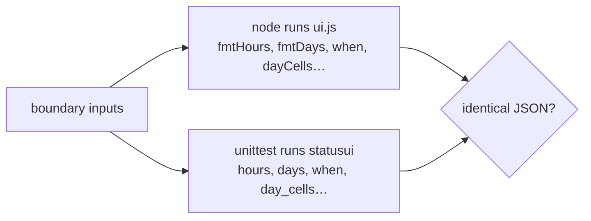

# 3. Hold the mirror to account
*~7 min read · PR #1 and commit `d553b7f` · 20 August 2026*

*Where we are:* the layer is a package with three consumers (chapters 1–2). It speaks two
languages — Python at build time, JavaScript in the browser — and this chapter is about the
day a test harness first made them answer the same question at the same time.

## The question that opened this stretch

The sites are static pages, but not *only* static: the build writes each page's initial
state with the Python helpers, and the reader's browser re-renders pieces of it — switching
month, filling a caption — with the JavaScript ones. The same duration, the same date, the
same day-bar cell can be formatted by either side depending on how the reader got there. So
the layer carries pairs: `hours()` and `fmtHours`, `days()` and `fmtDays`, `when()` both
sides, `month_label` and `monthLabel`, `day_cells` and `dayCells`. The pairs were written to
agree, reviewed to agree, and believed to agree.

Of the eleven birth tests, not one *ran* the JavaScript. The JS was inspected — its
globals listed, its top level walked for statements — but never executed, and the birth
test named `test_hours_mirrors_the_js` asserted the Python side against values a human
had worked out by reading the JS. The question, on the layer's second day as a package:
what is a mirror actually worth when only one side of it is ever switched on?

> **Concept: the mirror.** When one program spans two languages, every behaviour that exists
> in both is a translation, and translations drift. The options are: eliminate one side
> (make the browser fetch pre-formatted strings for everything — costs a request or a much
> bigger payload); generate one side from the other (a transpiler — heavy machinery for
> fourteen small functions); or keep writing both by hand and *hold them to identical
> output mechanically*. The third is the mirror. Its price is a harness that can run both
> languages in one test run; its reward is that agreement stops being a property of the
> author's care and becomes a property of the suite. The unit of testing shifts too: a
> normal test asserts `f(x) = expected`, a mirror test asserts `f(x) = g(x)` — no side is
> the specification, and a bug is a *disagreement*, which either side might be causing.

## What changed

### The harness (PR #1, 20 August)

The mechanism is small: a test class, skipped cleanly when `node` is not on the PATH,
concatenates `ui.js` with a scrap of generated JavaScript that feeds each paired function a
list of boundary-heavy inputs and prints the results as JSON; `unittest` runs the same
inputs through the Python side and asserts equality, list for list. Month names and the
part-day footnote — data the two sides each declare — are cross-checked statically as well.
One deliberate hole is documented where a completionist would close it: `slug` stays
unpaired, because the Python one folds fadas and trims edge dashes for the static URLs and
the JavaScript one never needed to, and pairing them would be sharing by ambition rather
than agreement (chapter 1's rule, applied to the layer itself).

The same PR paid down the rest of the stated-but-untested constitution: the ES5 floor on
`ui.js` (no arrows, no template literals, no `let`/`const` — chapter 4 is about *why*), the
Python floor, and the contrast claim from chapter 1 — every `*-text` token at 4.5:1 on both
backgrounds, and every fill that carries white lettering able to, in both colour schemes,
computed from the hex values by the test itself. A documentation comment became arithmetic.
The suite went from 11 tests to 30, +182 lines (PR #1, 20 Aug 2026).

### The mirror's first catch

Run for the first time, the mirror failed. At exact rounding ties — 2.25 hours — the two
sides disagreed: JavaScript's `toFixed(1)` rounds a tie up and prints **"2.3 h"**;
Python's `"%.1f"` rounds a tie to the even digit and prints **"2.2 h"**. Two pages of the
same site could show the same outage with two durations, and had been able to since the
sites existed — this bug predates the repo, living undetected in every hand-synced copy.
The whole-number branches already agreed, because the layer had long carried `half_up()`
for exactly this reason (JavaScript's `Math.round` rounds a half up; Python's `round()`
goes to even); only the one-decimal branch had never been routed through it. The fix in
PR #1: multiply by ten, `half_up`, divide — ties now round up on both sides. Suite green;
merged at 20:47.

### What went wrong: the fix that broke thirty-six commoner values

It lasted under two hours. The evening's sweep (commit `d553b7f`, 20 Aug, 20:42) found that
the ×10 detour had fixed the ties — which are rare — by breaking about **36 commoner values
in the 1–10 hour range**.

#### Worked example: why 1.15 is not 1.15

A computer stores 1.15 as the nearest available double, which is
1.149999999999999911… — a hair *under* the tie. Both formatters look at that stored number:
`toFixed(1)` sees something below 1.15 and prints "1.1 h", and so did the old `"%.1f"`.
Agreement, by accident, both sides wrong about the decimal but wrong *together*, which for
the mirror is what right means. Now route it through the tie fix: 1.15 × 10 does not give
1.1499…×10 exactly — floating-point multiplication re-rounds, and the nearest double to the
true product is exactly **11.5**. The detour has manufactured the very tie the input never
had; `half_up` dutifully takes it to 12, and Python prints "1.2 h" against JavaScript's
"1.1 h". The repair (`tenth()`, same commit): feed `Decimal` the float itself — `Decimal(x)`
is the stored double, digit for digit, not the string "1.15" — and quantize to one decimal
with `ROUND_HALF_UP`, which is `toFixed`'s own rule applied to the same number `toFixed`
sees. No detour, no manufactured ties.

The embarrassing part is that the first fix had gone green. The mirror's sample held
integers and exact ties — the values the author was thinking about — so it confirmed the
fix and missed the damage. The commit swept `hours()` against `fmtHours` under node from
0.01 h to 72 h in 0.01 steps: **7,200 values, no divergences** (commit `d553b7f`), and the
standing sample now carries 1.15, 1.45 and 8.95 so the tie-adjacent region stays guarded
without the sweep. A mirror is only as honest as its inputs; a boundary list written from
the implementation's branches tests the branches you knew you had.

The same commit closed a hole in a different guard: the ES5 test's regex required an
identifier character after `let`/`const`, so every destructuring declaration —
`const {a} = obj` — walked straight past it. The pattern became `\b(?:let|const)\b`. A
guard written the day before, already wrong once: chapter 2's lesson about stamps, replayed
on tests — a guard is a claim about content, and claims rot unless something reads them
against the thing they describe.

### How uisce does it

uisce's hardest measurement problem is truth against the *world*: is the model's reading of
a notice right? It answers with hand-labelled samples and confidence bounds (its chapter
5b). This repo's hardest measurement problem is truth against *itself*: do two translations
agree? It answers with a mirror, no ground truth required — at the price that the mirror
cannot say either side is *correct*, only consistent, as the 1.15-by-accident case shows.
The two repos also split the boundary between them: this side holds the pairs identical;
each consumer holds a `test_ui_globals` guard promising its own scripts redeclare nothing
the layer defines. The treaty has two signatures — `JS_GLOBALS`, the exhaustive list of
names `ui.js` declares, is maintained here precisely so the sites can enforce their half.
And the runners differ on brand: uisce runs pytest; this repo is standard-library
throughout — `unittest`, `re`, `subprocess` and a `node` binary, no test dependencies at
all — because a layer three repos install should bring as close to nothing as possible
(chapter 4 makes that a floor).

## Where it left the layer

Thirty tests, one real cross-language bug found and fixed twice, three constitutional
clauses turned from comments into assertions, and a habit the rest of the history keeps:
every later promotion into the layer (chapter 5) arrives with either a mirror pairing or —
where no Python twin exists — a node test of its own. The remaining weakness was
operational, not logical: the mirror only runs where `node` happens to be installed, and a
skipped guard looks exactly like a passed one from a distance. Making that impossible to
miss is where chapter 4 starts.

## Notes

- PR #1 / commit `2bff71c` (20 Aug 2026, merged 20:47): harness design, 11 → 30 tests,
  +182 test lines; the 2.25 h divergence ("2.3 h" vs "2.2 h"); `slug` left unpaired;
  ES5/floor/contrast/sitemap/`size_report` guards. Figures from the commit message and PR
  body.
- Commit `d553b7f` (20 Aug, 20:42): ~36 broken values in 1–10 h; 1.15 → 1.1499… →
  ×10 = exactly 11.5; `tenth()` via `Decimal(float)` + `ROUND_HALF_UP`; sweep 0.01–72 h at
  0.01 steps = 7,200 values, no divergences; `\b(?:let|const)\b`. All from the commit
  message.
- `half_up`'s purpose (Math.round vs round()) from its comment in
  `src/statusui/__init__.py`; mirror sample values and the `TestMirror` skip guard verified
  against `tests/test_ui.py`, 27 Aug 2026.
- Consumer-side `test_ui_globals` convention: uisce PR #48 / uisce series ch 14; esb and
  lifts equivalents referenced in PR #3's body (chapter 5).
